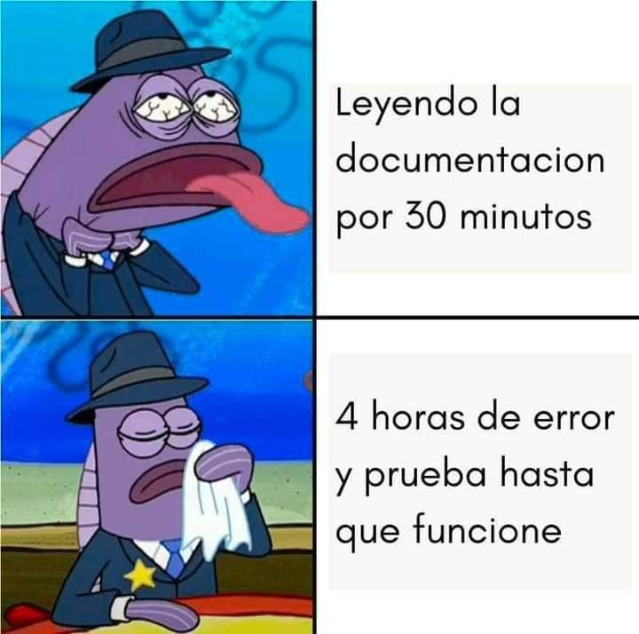

# Análisis de Calidad 

Aquí encontrarás el material necesario para realizar un análisis de calidad de lecturas de secuenciación, obtenidas por *Next-generation sequencing (NGS)*, para una secuenciación de tipo *paired-end*. 

Los archivos **interaccion.sh** y **analisis.sh** son los script´s necesarios para automatizar esta tarea usando el *shell* **Bash**. Por ende, esto solo podrá ejecutarse en sistemas operativos tipo *Unix*.

El análisis requiere de las herraminetas [FastQC](https://www.bioinformatics.babraham.ac.uk/projects/fastqc/) y [MultiQC](https://seqera.io/multiqc/). Para mayor comodidad puedes descargar el [ambiente Conda](https://docs.conda.io/projects/conda/en/latest/user-guide/tasks/manage-environments.html) que hemos generado con las librerías necesarias. Descarga el archivo **QualityControl.yml** y ejecuta:

    conda env create -f QualityControl.yml

 Esto crea el ambiente de Conda con las herramientas necesarias. Ahora solo deberás activarlo. Para ello ejecuta:

    conda activate QualityControl

Para realizar el análsis debes ejecutar el script **interaccion.sh** en el mismo directorio donde tienes tus archivos de secuenciación.

Para correr un script normalmente se ejecuta './script.sh'. Entonces, en este caso deberás ejecutar:

    ./interaccion.sh

Lo anterior desplegará un conjunto de mensajes en pantalla para introducirte al análisis y te preguntará si estás listo para hacerlo. Si tu respuesta es positiva verificará que tengas los requeriminetos necesarios y en caso de éxito lanzará el scrip **analisis.sh** en segundo plano. Nosotros recomendamos ejecutarlo en segundo plano, así puedes seguir trabajando en la misma terminal y tu proceso se ejecuta sin importar que cierres dicha terminal. Así puedes irte casa mientras la computadora hace el análisis. Además, se imprimirá el PID del proceso en la terminal, así podrás darle seguimiento. Finalmente, el archivo nohup.out servirá como registró del análisis, puedes monitorear el progreso del análisis ejecutando:

    tail -f nohup.out 

Nota: en la carpeta **test_reads** hay un conjunto de lecturas *paired-end* que puedes utilizar para probar este programa.

